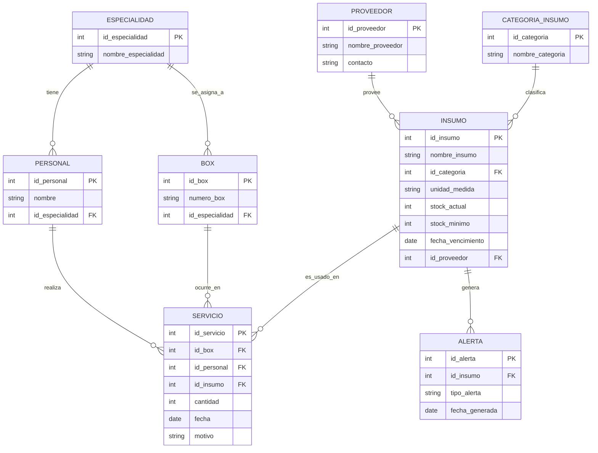

## Sistema de gestión de insumos —
### Consultorio Santa María Josefa

Proyecto de la asignatura Taller Base de Datos (AIEP, NRC
PRO202) — Actividad de Aprendizaje + Servicio.

### Objetivos
1. Implementar un sistema de base de datos que permita
registrar el 100% de los insumos utilizados por box,
especialidad y profesional en el consultorio "Santa
María Josefa", eliminando el registro manual en papel
actualmente utilizado.

3. Generar reportes automatizados mediante consultas
SQL que permitan al consultorio identificar en cualquier
momento el consumo de insumos por box,
especialidad y profesional, reduciendo el desfase entre
el stock real y el stock registrado.

5. Implementar un mecanismo de alerta automática
dentro del sistema que notifique al personal del
consultorio y al proveedor cuando el stock de un
insumo alcance o esté por debajo del stock mínimo
definido, o cuando un insumo esté próximo a su fecha
de vencimiento, permitiendo la reposición o el retiro
oportuno antes de que se agote o venza.

### Entidades y atributos
Especialidad: id_especialidad (PK),
nombre_especialidad

Personal: id_personal (PK), nombre, id_especialidad
(FK)

Box: id_box (PK), numero_box, id_especialidad (FK)

Proveedor: id_proveedor (PK), nombre_proveedor,
contacto

Categoria_Insumo: id_categoria (PK),
nombre_categoria

Insumo: id_insumo (PK), nombre_insumo, id_categoria
(FK), unidad_medida, stock_actual, stock_minimo,
fecha_vencimiento, id_proveedor (FK)

Servicio: id_servicio (PK), id_box (FK), id_personal (FK),
id_insumo (FK), cantidad, fecha, motivo

Alerta: id_alerta (PK), id_insumo (FK), tipo_alerta,
fecha_generada

### Modelo entidad-relación

