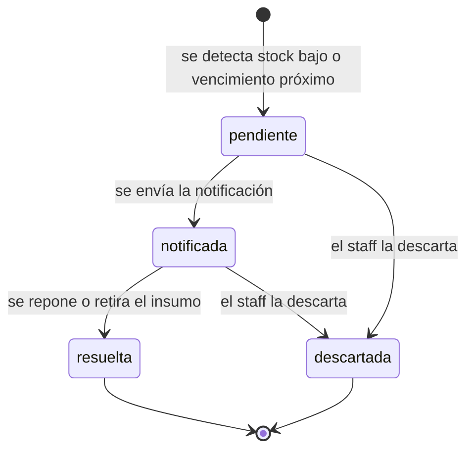

[message.txt](https://github.com/user-attachments/files/32713838/message.txt)
## Sistema de gestión de insumos —
### Consultorio Santa María Josefa

Proyecto de la asignatura Taller Base de Datos (AIEP, NRC
PRO202) — Actividad de Aprendizaje + Servicio.

### Objetivos
1. Implementar un sistema de base de datos que permita
registrar el 100% de los insumos utilizados por box,
especialidad y profesional en el consultorio "Santa
María Josefa", eliminando el registro manual en papel
actualmente utilizado.

3. Generar reportes automatizados mediante consultas
SQL que permitan al consultorio identificar en cualquier
momento el consumo de insumos por box,
especialidad y profesional, reduciendo el desfase entre
el stock real y el stock registrado.

5. Implementar un mecanismo de alerta automática
dentro del sistema que notifique al personal del
consultorio y al proveedor cuando el stock de un
insumo alcance o esté por debajo del stock mínimo
definido, o cuando un insumo esté próximo a su fecha
de vencimiento, permitiendo la reposición o el retiro
oportuno antes de que se agote o venza.

### Entidades y atributos
Especialidad: id_especialidad (PK), nombre_especialidad

Box: id_box (PK), numero_box, id_especialidad (FK)

Staff: id_staff (PK), nombre, correo, telefono,
id_especialidad (FK)

Proveedor: id_proveedor (PK), nombre_proveedor, correo,
telefono

Categoria_Insumo: id_categoria (PK), nombre_categoria

Insumo: id_insumo (PK), nombre_insumo, id_categoria (FK),
unidad_medida, stock_actual, stock_minimo,
fecha_vencimiento, id_proveedor (FK)

Servicio: id_servicio (PK), id_box (FK), id_staff (FK),
fecha, motivo

Ingreso_insumo: id_ingreso (PK), id_proveedor (FK), id_staff (FK),
tipo_origen, fecha, observacion

Detalle_Servicio: id_servicio (PK, FK), id_insumo (PK, FK),
cantidad

Detalle_Ingreso: id_ingreso (PK, FK), id_insumo (PK, FK),
cantidad

Salida_insumo: id_salida (PK), id_staff (FK), fecha, motivo,
observacion

Detalle_Salida: id_salida (PK, FK), id_insumo (PK, FK),
cantidad

Alerta: id_alerta (PK), id_insumo (FK), tipo_alerta, mensaje,
fecha_generada, estado

Canal_Comunicacion: id_canal (PK), nombre_canal

Notificacion: id_notificacion (PK), id_alerta (FK), id_canal (FK),
id_staff (FK), id_proveedor (FK), fecha_envio, estado_envio

### Modelo entidad-relación

```mermaid
erDiagram
  ESPECIALIDAD ||--o{ BOX : se_asigna_a
  ESPECIALIDAD ||--o{ STAFF : tiene
  STAFF ||--o{ SERVICIO : realiza
  BOX ||--o{ SERVICIO : ocurre_en
  STAFF ||--o{ INGRESO_INSUMO : registra
  PROVEEDOR ||--o{ INGRESO_INSUMO : entrega
  PROVEEDOR ||--o{ INSUMO : provee
  CATEGORIA_INSUMO ||--o{ INSUMO : clasifica
  SERVICIO ||--o{ DETALLE_SERVICIO : incluye
  INSUMO ||--o{ DETALLE_SERVICIO : es_usado_en
  INGRESO_INSUMO ||--o{ DETALLE_INGRESO : incluye
  INSUMO ||--o{ DETALLE_INGRESO : es_recibido_en
  STAFF ||--o{ SALIDA_INSUMO : registra_salida
  SALIDA_INSUMO ||--o{ DETALLE_SALIDA : incluye
  INSUMO ||--o{ DETALLE_SALIDA : es_retirado_en
  INSUMO ||--o{ ALERTA : genera
  ALERTA ||--o{ NOTIFICACION : se_envia_mediante
  CANAL_COMUNICACION ||--o{ NOTIFICACION : usa
  STAFF ||--o{ NOTIFICACION : recibe
  PROVEEDOR ||--o{ NOTIFICACION : recibe

  ESPECIALIDAD {
    int id_especialidad PK "Identificador unico de la especialidad"
    string nombre_especialidad "Nombre de la especialidad medica"
  }
  BOX {
    int id_box PK "Identificador unico del box"
    string numero_box "Numero o codigo del box fisico"
    int id_especialidad FK "Especialidad asignada al box"
  }
  STAFF {
    int id_staff PK "Identificador unico del miembro del staff"
    string nombre "Nombre completo del miembro del staff"
    string correo "Correo de contacto"
    string telefono "Telefono de contacto"
    int id_especialidad FK "Especialidad del miembro del staff"
  }
  PROVEEDOR {
    int id_proveedor PK "Identificador unico del proveedor"
    string nombre_proveedor "Nombre o razon social del proveedor"
    string correo "Correo de contacto del proveedor"
    string telefono "Telefono de contacto del proveedor"
  }
  CATEGORIA_INSUMO {
    int id_categoria PK "Identificador unico de la categoria"
    string nombre_categoria "Nombre de la categoria de insumo"
  }
  INSUMO {
    int id_insumo PK "Identificador unico del insumo"
    string nombre_insumo "Nombre del insumo"
    int id_categoria FK "Categoria a la que pertenece"
    string unidad_medida "Unidad en que se mide (unidad, caja, ml)"
    int stock_actual "Cantidad disponible en bodega"
    int stock_minimo "Cantidad minima antes de alertar"
    date fecha_vencimiento "Fecha de vencimiento del insumo"
    int id_proveedor FK "Proveedor habitual del insumo"
  }
  SERVICIO {
    int id_servicio PK "Identificador unico de la consulta"
    int id_box FK "Box donde se realizo la consulta"
    int id_staff FK "Staff que realizo la consulta"
    date fecha "Fecha de la consulta"
    string motivo "Motivo de la consulta"
  }
  INGRESO_INSUMO {
    int id_ingreso PK "Identificador unico del ingreso"
    int id_proveedor FK "Proveedor que entrego el ingreso"
    int id_staff FK "Staff que registro el ingreso"
    string tipo_origen "Origen del ingreso, ej compra o donacion"
    date fecha "Fecha del ingreso"
    string observacion "Observaciones del ingreso"
  }
  DETALLE_SERVICIO {
    int id_servicio PK,FK "Consulta a la que pertenece el detalle"
    int id_insumo PK,FK "Insumo utilizado en la consulta"
    int cantidad "Cantidad de insumo utilizada"
  }
  DETALLE_INGRESO {
    int id_ingreso PK,FK "Ingreso al que pertenece el detalle"
    int id_insumo PK,FK "Insumo que se recibio"
    int cantidad "Cantidad de insumo recibida"
  }
  SALIDA_INSUMO {
    int id_salida PK "Identificador unico de la salida"
    int id_staff FK "Staff que registro la salida"
    date fecha "Fecha de la salida"
    string motivo "Motivo: vencimiento, merma o ajuste por conteo"
    string observacion "Observaciones de la salida"
  }
  DETALLE_SALIDA {
    int id_salida PK,FK "Salida a la que pertenece el detalle"
    int id_insumo PK,FK "Insumo que sale del stock"
    int cantidad "Cantidad de insumo que sale"
  }
  ALERTA {
    int id_alerta PK "Identificador unico de la alerta"
    int id_insumo FK "Insumo que genero la alerta"
    string tipo_alerta "Tipo, ej stock minimo o vencimiento"
    string mensaje "Mensaje descriptivo de la alerta"
    date fecha_generada "Fecha en que se genero la alerta"
    string estado "Estado: pendiente, notificada, resuelta o descartada"
  }
  CANAL_COMUNICACION {
    int id_canal PK "Identificador unico del canal"
    string nombre_canal "Nombre del canal, ej correo o whatsapp"
  }
  NOTIFICACION {
    int id_notificacion PK "Identificador unico de la notificacion"
    int id_alerta FK "Alerta que origino la notificacion"
    int id_canal FK "Canal por el que se envio"
    int id_staff FK "Staff destinatario (nulo si el destinatario es proveedor)"
    int id_proveedor FK "Proveedor destinatario (nulo si el destinatario es staff)"
    date fecha_envio "Fecha de envio de la notificacion"
    string estado_envio "Estado: pendiente, enviado o fallido"
  }
```

### Proceso de normalización (1FN a 3FN)

**Primera forma normal (1FN).** Todas las tablas tienen llave primaria, todos los
atributos son atómicos (un solo valor por campo: un correo, un teléfono, una
fecha) y no hay grupos repetitivos. Por eso una consulta, un ingreso o una
salida que involucra varios insumos no se guarda en una sola fila con una lista
de insumos, sino como una fila por insumo en `DETALLE_SERVICIO`,
`DETALLE_INGRESO` y `DETALLE_SALIDA`.

**Segunda forma normal (2FN).** Solo las tres tablas de detalle tienen llave
compuesta. En todas, `cantidad` depende de la llave completa (qué insumo, en qué
consulta, ingreso o salida). Si `fecha`, `motivo`, `id_box` o `id_staff` estuvieran
en esas mismas tablas, dependerían solo de `id_servicio`, `id_ingreso` o
`id_salida` (parte de la llave) y se violaría la 2FN; por eso viven en `SERVICIO`,
`INGRESO_INSUMO` y `SALIDA_INSUMO`. Las
demás tablas tienen llave de una sola columna, así que cumplen 2FN
automáticamente.

**Tercera forma normal (3FN).** Ningún atributo que no es llave depende de otro
atributo que tampoco es llave. Al revisar cada tabla se encontró un caso:

- `NOTIFICACION` tenía `tipo_destinatario` (staff o proveedor), pero ese valor
  se deduce de cuál de las dos llaves, `id_staff` o `id_proveedor`, tiene dato.
  Era una dependencia transitiva (`id_notificacion` → `id_staff`/`id_proveedor` →
  `tipo_destinatario`), así que se eliminó el atributo. Regla que lo reemplaza:
  en cada notificación exactamente una de las dos llaves debe tener valor
  (restricción `CHECK` al crear la tabla en PostgreSQL).

| Tabla | Llave | Dependencias funcionales | 1FN | 2FN | 3FN |
|---|---|---|---|---|---|
| ESPECIALIDAD | id_especialidad | → nombre_especialidad | Sí | Sí | Sí |
| BOX | id_box | → numero_box, id_especialidad | Sí | Sí | Sí |
| STAFF | id_staff | → nombre, correo, telefono, id_especialidad | Sí | Sí | Sí |
| PROVEEDOR | id_proveedor | → nombre_proveedor, correo, telefono | Sí | Sí | Sí |
| CATEGORIA_INSUMO | id_categoria | → nombre_categoria | Sí | Sí | Sí |
| INSUMO | id_insumo | → nombre_insumo, id_categoria, unidad_medida, stock_actual, stock_minimo, fecha_vencimiento, id_proveedor | Sí | Sí | Sí |
| SERVICIO | id_servicio | → id_box, id_staff, fecha, motivo | Sí | Sí | Sí |
| INGRESO_INSUMO | id_ingreso | → id_proveedor, id_staff, tipo_origen, fecha, observacion | Sí | Sí | Sí |
| DETALLE_SERVICIO | id_servicio + id_insumo | → cantidad | Sí | Sí | Sí |
| DETALLE_INGRESO | id_ingreso + id_insumo | → cantidad | Sí | Sí | Sí |
| SALIDA_INSUMO | id_salida | → id_staff, fecha, motivo, observacion | Sí | Sí | Sí |
| DETALLE_SALIDA | id_salida + id_insumo | → cantidad | Sí | Sí | Sí |
| ALERTA | id_alerta | → id_insumo, tipo_alerta, mensaje, fecha_generada, estado | Sí | Sí | Sí |
| CANAL_COMUNICACION | id_canal | → nombre_canal | Sí | Sí | Sí |
| NOTIFICACION | id_notificacion | → id_alerta, id_canal, id_staff, id_proveedor, fecha_envio, estado_envio | Sí | Sí | Sí |

**Decisiones de diseño que se mantienen.**

- `INSUMO.stock_actual` es un dato derivado (total recibido en
  `DETALLE_INGRESO` menos lo usado en `DETALLE_SERVICIO` y lo retirado en
  `DETALLE_SALIDA`). Se conserva a propósito para consultar el stock rápido y
  comparar con `stock_minimo`, y se actualiza cada vez que se registra un
  ingreso, un servicio o una salida.
- `INSUMO.fecha_vencimiento` asume una sola fecha por insumo. Si el consultorio
  recibe el mismo insumo en lotes con fechas distintas, habría que pasar la
  fecha a `DETALLE_INGRESO` (una fecha por lote recibido).

### Estados de la alerta
El campo `estado` de `ALERTA` cambia a medida que el sistema y el equipo
del consultorio actúan sobre ella:

| Estado | Significado | Cuándo cambia |
|---|---|---|
| pendiente | La alerta se generó (stock bajo el mínimo o insumo próximo a vencer) y aún no se avisa a nadie | Al detectarse la condición |
| notificada | Se envió la notificación al staff y/o al proveedor | Cuando se registra una `NOTIFICACION` con `estado_envio` = enviado |
| resuelta | Se repuso el stock o se retiró el insumo por vencer | Al registrarse un `INGRESO_INSUMO` del insumo o una `SALIDA_INSUMO` por vencimiento |
| descartada | La alerta ya no aplica (por ejemplo, se generó por error) | Cuando el staff la cierra manualmente |

